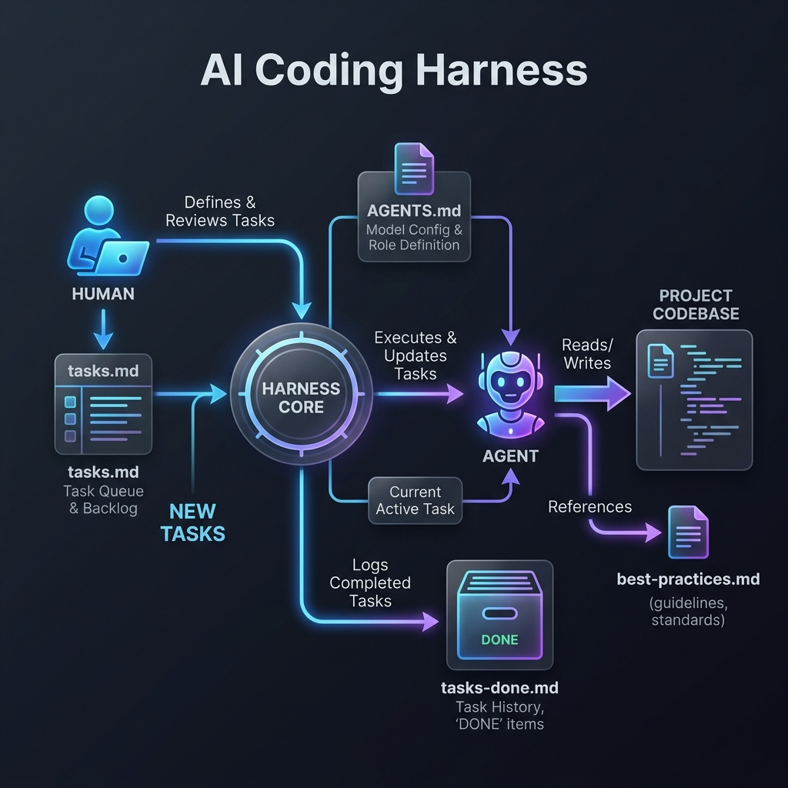
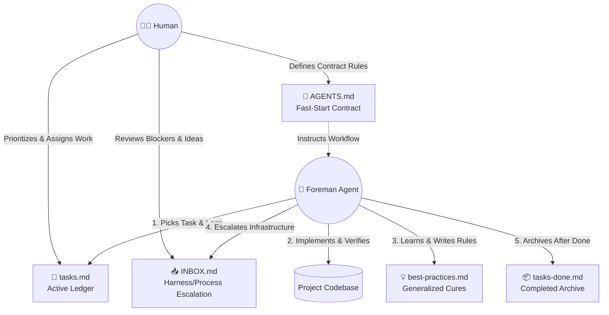

# Harness 结构导航与文档树

这份导航清单详细解释了控制 Easy Engine Harness 运作的主体文件，以及智能体（Agent）在前后台工作流的哪个阶段会读取或更新它们。

## 🕸️ 工作流全景图 (Harness Stream Diagram)

点击查看文本格式的 Mermaid 流程图

---

## 🏛️ 1. 核心治理规范 (Core Governance)

这些文件定义了全局游戏规则。

*   **[`AGENTS.md`](../AGENTS.md)** 
    *   **作用**：监工模型（Foreman）的“快速启动宪法” 和操作契约。里面明确了什么该做、什么严禁操作，以及代码提交的必经步骤。
    *   **模型使用阶段**：**全生命周期 / Pick 阶段前**。模型在接受任何人类下达的任务前，必须强制阅读此文件，以保证其接下来的动作不违背最新守则。

---

## 📖 2. 工作流台账 (Workflow Ledgers)

这些文件代表了当前正在流动的任务追踪状态记录。

*   **[`tasks.md`](../tasks.md)**
    *   **作用**：活跃任务列队。任何人或大目标都会首先化成长短不一的 todo 列表扔进这个池子。
    *   **模型使用阶段**：**Select（任务领取）**, **Investigate（开发执行）**, **Review（审查与复盘）**。模型在这里认领工作，并在执行过程中不断将进度碎片（Files changed, Results）和复盘原因实时写回文件的 Progress log。
*   **[`tasks-done.md`](../tasks-done.md)**
    *   **作用**：已完成任务的物理隔离归档库。
    *   **模型使用阶段**：**Closeout（收尾关单）**。仅当任务在 `tasks.md` 中完全落地且被标记为 `done` 时，模型才在 git commit 的前一刻将其剪切至此。

---

## 🛡️ 3. 拦截阻塞与知识沉淀 (Escalation & Knowledge)

用来处理异常边界情况，防止垃圾信息塞满主任务列表。

*   **[`INBOX.md`](../INBOX.md)**
    *   **作用**：处理框架本身受阻、测试脚手架缺失或其他亟需人类裁决的疑难杂症收件箱。
    *   **模型使用阶段**：**Blocked（进度受阻升级）**。只要遭遇重复失败（或超过设定的 max attempts）且原因非代码逻辑而是系统治理问题，模型便应当在此抛出“人类决策请求 (escalation)”。
*   **[`docs/operations/best-practices.md`](../docs/operations/best-practices.md)**
    *   **作用**：动态积累的代码治理指南与通用防错建议（解药库）。
    *   **模型使用阶段**：**Post-mortem（修正与复盘环节）**。在修好一个 Bug 后，模型会把导致问题的本质原因进行“通用化总结 (Generalization)” 并登记在此，以此跨任务提升未来的代码质量。

---

## ⚙️ 4. 机器验证隔离层 (Machine Validation)

提供冷酷的执行标准，避免模型在自编自导。

*   **[`.agent/config.json`](../.agent/config.json)**
    *   **作用**：定义哪些目录被视为架构目录，保存各模块需要跑哪些标准验证命令的黑白名单。
    *   **模型使用阶段**：**Verify / Validate（验证与测试）**。模型完成局部修改进入验证流程时，需从该文件里提取特定模块的指令（例如 manager 必须运行的 Maven 命令）去跑测试。

---

## 📚 5. 长效上下文库 (Long-term Context / `docs/`)

由于大型模型存在上下文与注意力瓶颈，Harness 采用**“懒加载 (Lazy-loading)”**机制。除 `AGENTS.md` 和 `tasks.md` 等核心骨干外，下方的深层目录内容**不强制在每次启动全量载入**。只有在被明确指令要求，或者模型在 `Investigate` 阶段主动遇到知识盲点时，才会顺藤摸瓜去查阅。

*   **`docs/exec-plans/` (落地方案)**
    *   **作用与机制**：存放人类编写的复杂大目标实施蓝图（如架构重构）。人类通常会在 `tasks.md` 指控中心里用链接 `[参考方案](...)` 指向这里，从而触发模型去读取。任务集群落地完结后，方案归档进 `completed/`。
*   **`docs/architecture/` (架构导引)**
    *   **作用与机制**：宏观微服务拓扑与 HTTP/API 契约边界。遇到跨模块任务时模型主动查阅；并且，如果模型修改了被保护的代码，会被机制强制拦截，要求进入 **Doc-gardening（修剪文档）** 环节，去翻新这里的相关架构图。
*   **`docs/operations/` (运维法则)**
    *   **作用与机制**：记录除了 `best-practices` 之外的“研发软纪律”，如针对人类干预边界的说明 (`human-collaboration.md`)。
*   **`docs/product/` (产品与需求定义)**
    *   **作用与机制**：人类打磨未转化为技术任务的原始产品设计草图池 (`roadmap.md`, `backlog.md` 等)。
*   **`docs/modules/` (模块显微镜)**
    *   **作用与机制**：深入单个服务（如专门针对 `benchmark` 或 `manager`）的微观运作手册。方便模型在专精某个领域的 Bug 修复时实现“上下文瘦身”。
*   **`docs/generated/` (机器快照树)**
    *   **作用与机制**：专门存放用脚本一键刷出来的静态系统快照（如 `repo-map.md`）。供模型快速扫描全局代码骨架，省去了在终端里跑耗时命令的麻烦。
