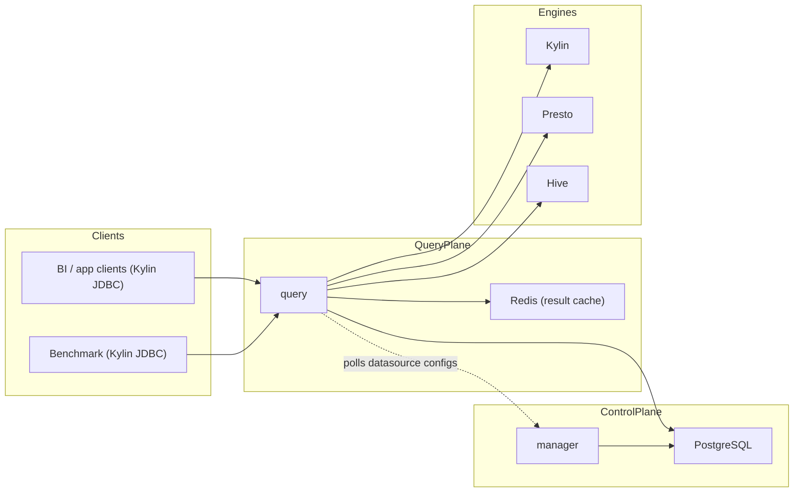

# Runtime Topology

## Default Local Topology

## Service Ports

- `manager`: `8090`
- `benchmark`: `8091`
- `query`: `8092`
- `postgres`: `5433`
- `redis`: `6380`
- `kylin`: `17070`
- `presto`: `18081`

## Operational Notes

- `benchmark` connects to `query` using the standard Apache Kylin JDBC driver (`jdbc:kylin://localhost:8092/<project>`).
- `query` fetches datasource configurations from `manager` on startup. It falls back to static config if manager is unreachable.
- `query` writes execution trace records directly to PostgreSQL; no Redis trace queue is used.
- `query` should keep serving traffic if Redis is unavailable by degrading to direct datasource execution.
- `manager` should not bring down the runtime when Calcite parsing has transient failures.
- The root harness should run from the repository root, not from individual submodules.
