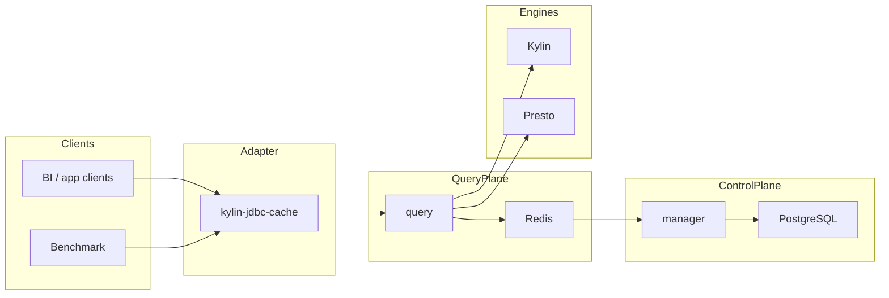

# Runtime Topology

## Default Local Topology

## Service Ports

- `manager`: `8090`
- `benchmark`: `8091`
- `query`: `8092`
- `postgres`: `5433`
- `redis`: `6380`
- `kylin`: `17070`
- `presto`: `18081`

## Operational Notes

- `benchmark` depends on `query` semantics when using the cached JDBC route.
- `query` should keep serving traffic if Redis is unavailable by degrading to direct datasource execution.
- `manager` should not bring down the runtime when Redis or Calcite parsing has transient failures.
- The root harness should run from the repository root, not from individual submodules.
